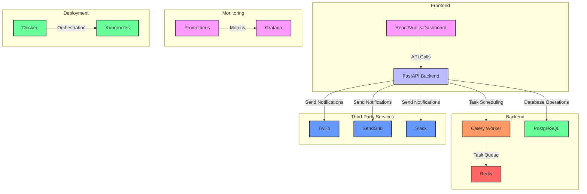

# PulseCheck - Uptime monitoring and SSL management system

🚧 **UNDER DEVELOPMENT** 🚧  

A modern, all-in-one uptime monitoring and SSL certificate health tool designed to keep your websites and applications running smoothly. With real-time notifications via email, SMS, and Slack, PulseCheck ensures you're always informed about downtime, SSL expirations, and critical issues—so you can act fast and stay ahead.

## **Objective**  
The goal of this project is to help businesses and individuals stay informed about the status of their applications and websites by:  
- Ensuring minimal downtime with quick alerts.  
- Proactively notifying about SSL certificate expiry.  
- Offering a centralized dashboard for status monitoring and alert management.  

## **Features (Planned)**  
1. **Uptime Monitoring**:  
   - Periodically checks the availability of registered websites and applications.  
2. **SSL Monitoring**:  
   - Tracks SSL certificate expiration and notifies users in advance.  
3. **Real-Time Alerts**:  
   - Sends notifications via SMS, email, and Slack when issues are detected.  
4. **Customizable Alerts**:  
   - Allow users to set alert thresholds and notification preferences.  
5. **Dashboard**:  
   - Displays application status history, SSL expiry dates, and recent alerts.  

## **Technology Stack**  
- **Backend**: FastAPI (Python)  
- **Database**: PostgreSQL  
- **Background Task Processing**: Celery or APScheduler  
- **Notifications**: Twilio, Slack SDK, Amazon SES  
- **Frontend**: (To be decided, likely React or HTMX)

## **Architecture Diagram**

## **Current Status**  
The project is in its early development stages. Core features such as uptime monitoring and SSL checks are being prototyped.  

## **Intentions**  
This project aims to:  
- Provide an accessible, user-friendly solution for monitoring uptime and SSL health.  
- Offer a scalable platform for small to medium-sized businesses.  
- Eventually evolve into a SaaS product with subscription tiers and advanced analytics.  

## **Getting Started**  
This repository will soon include setup instructions, including how to:  
1. Clone the repository.  
2. Install dependencies.  
3. Run the application locally.  

Stay tuned for updates!  

## **Contributing**  
Contributions are welcome! If you'd like to collaborate, please fork this repository and submit a pull request with your changes.  
